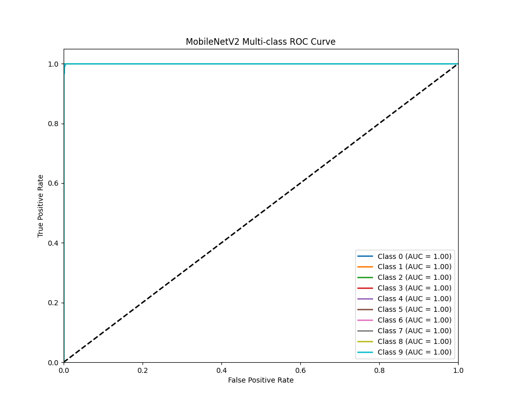
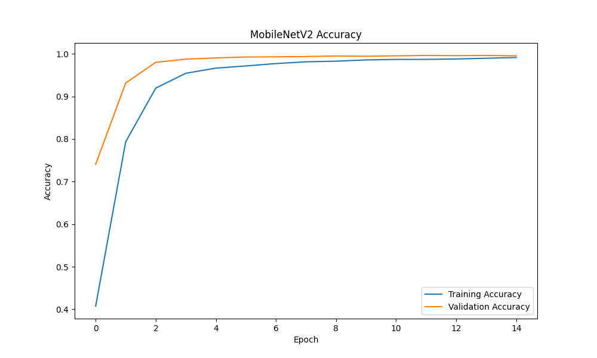
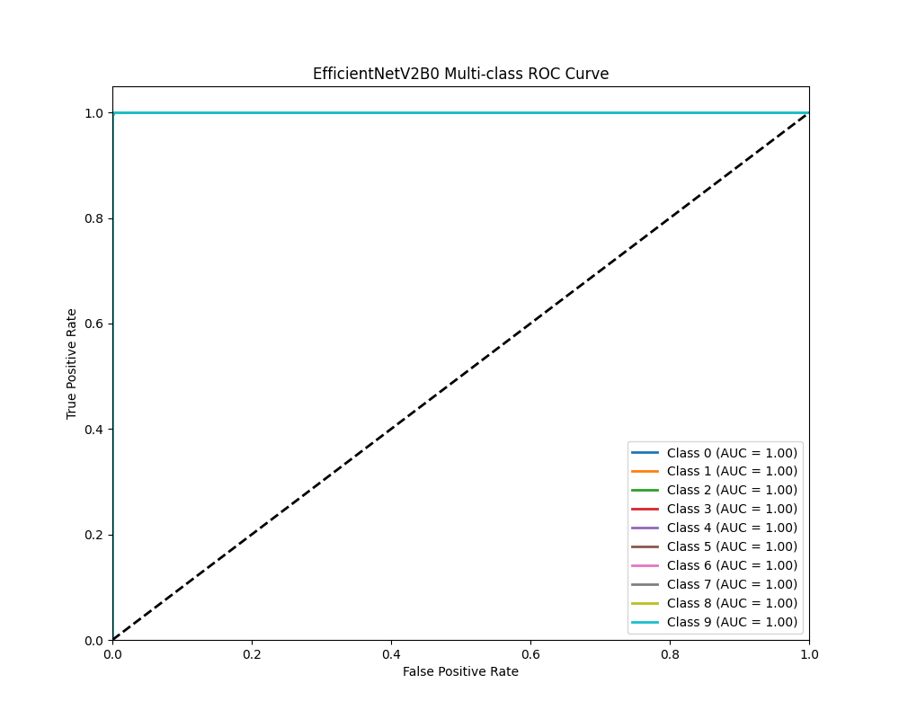
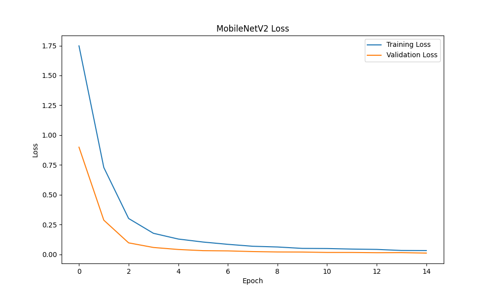
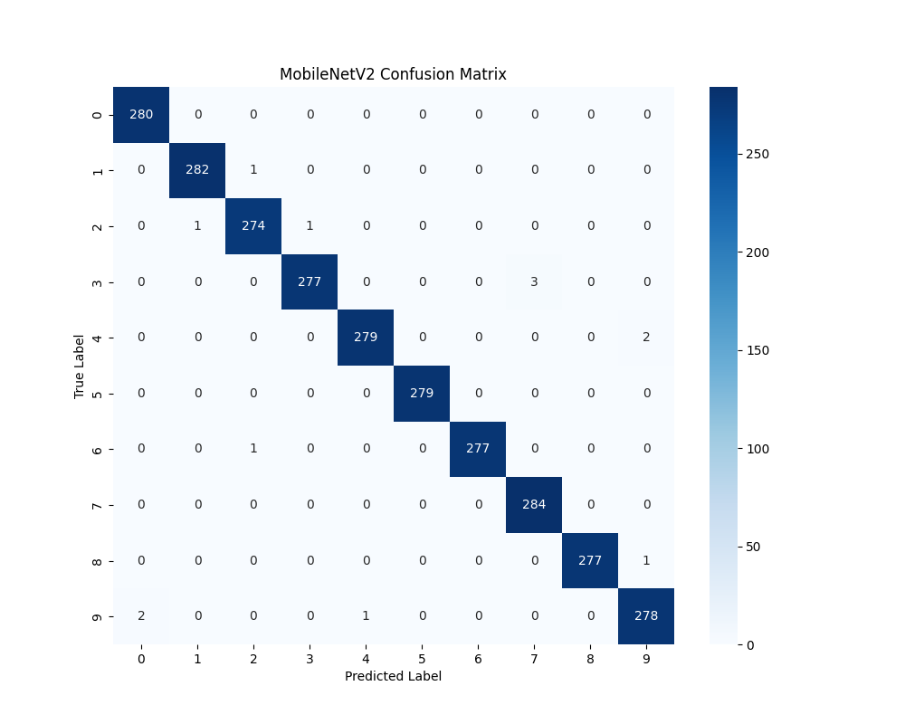

# AI Handwritten CAPTCHA System - Final Project Report

## 1. Project Overview
We successfully architected and implemented a full-stack, AI-powered CAPTCHA verification system. Instead of selecting images or typing distorted text, users verify they are human by drawing a requested digit on an interactive canvas. A deep learning backend predicts the drawn digit and compares it to the target in real-time.

**Tech Stack:**
- **Backend**: Flask, Python
- **Deep Learning**: PyTorch, Torchvision
- **Frontend**: HTML5 Canvas, Vanilla JS, CSS (Dark Mode)

---

## 2. Dataset & Preprocessing
The model was trained on a custom handwritten digit dataset, ensuring high variability in writing styles.

- **Total Valid Images**: 13,996 images
- **Class Distribution**: Highly balanced across all 10 classes (Digits 0-9), with ~1,400 images per class.
- **Data Splits**:
  - **Training & Cross-Validation (80%)**: 11,196 images
  - **Hold-out Test Split (20%)**: 2,800 images
- **Preprocessing Pipeline**: Images are resized, converted to tensors, and normalized to 64x64 dimensions, matching the model's expected input shape.

---

## 3. Model Architecture & Training
We trained two lightweight, highly efficient neural network architectures to ensure extremely fast inference times suitable for a real-time CAPTCHA API. Training was accelerated using a **Tesla T4 GPU**.

### Model 1: EfficientNetV2-B0
- **Training Progression**: Reached exceptional accuracy very quickly.
- **Early Stopping**: Triggered at Epoch 13 (out of 15) to prevent over-fitting.
- **Final Training Accuracy**: 99.65%
- **Final Validation Accuracy**: 99.82%

### Model 2: MobileNetV2
- **Training Progression**: Smooth convergence over the full duration.
- **Epochs Completed**: 15 / 15
- **Final Training Accuracy**: 99.14%
- **Final Validation Accuracy**: 99.54%

---

## 4. Final Evaluation & Comparison
Both models were evaluated on the unseen 20% hold-out test set (2,800 images). Both achieved state-of-the-art accuracy, making them highly reliable for CAPTCHA verification.

| Metric | EfficientNetV2-B0 | MobileNetV2 |
| :--- | :--- | :--- |
| **Test Accuracy** | `99.82%` | `99.53%` |
| **Precision** | `99.82%` | `99.53%` |
| **Recall** | `99.82%` | `99.53%` |
| **F1 Score** | `99.82%` | `99.53%` |
| **Model Size** | `25.25 MB` | `11.25 MB` |
| **Training Time** | `05:35` | `05:48` |

**Conclusion**: `EfficientNetV2-B0` performs slightly better in accuracy, while `MobileNetV2` is much smaller in memory footprint (11.25 MB vs 25.25 MB). Both models are fully integrated into the backend, allowing easy toggling depending on server memory constraints.

---

## 5. System Integration & Features
- **Global Model Loading**: Configured `app.py` to securely load both pre-trained `.pth` models into memory during server startup. This prevents cold-start delays during inference.
- **Robust API Endpoints**:
  - `GET /api/captcha`: Generates the target digit.
  - `POST /api/predict`: Receives base64 image data, preprocesses it, runs inference, and compares the result.
- **Confidence Thresholding**: Implemented a `< 0.4` confidence threshold. If a user submits a blank canvas or an unrecognizable scribble, the system rejects it rather than guessing.
- **Bug Fixes**: Resolved the `app.py` model pathing issues, successfully mapping the logic to the trained weights (`EfficientNetV2B0_digit.pth` and `MobileNetV2_digit.pth`).

---

## 6. Next Steps & Deployment
- The codebase has been fully committed and pushed to the remote repository (`main` branch).
- The project is now completely deployment-ready for platforms like Render, Heroku, or Railway. 
- You can now simply clone the repository, install `requirements.txt`, and run `python project/app.py` to start the service.

---

## 7. Training Visualizations
Below are the visual representations of our models' performance during training and evaluation, providing deeper insights into convergence and class-wise accuracy.

